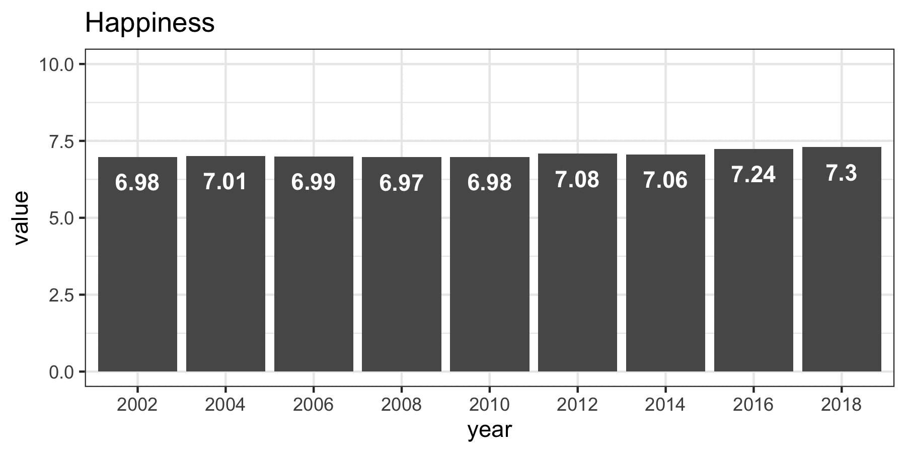
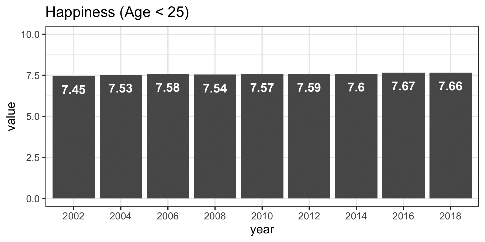

```{r global_options, include=FALSE}
library(knitr)
knitr::opts_chunk$set(warning = FALSE, message = FALSE,
                      fig.height = 5, cache = FALSE)
```

# Set-up

First, load packages.

```{r}
# load packages
packages <- c("car", "foreign", "haven", "knitr", "lme4",
              "magrittr", "plyr", "tidyverse")
invisible(lapply(packages, library, character.only = TRUE))
```

Then, load data.

```{r LoadData, cache=TRUE}
# load data
## you can download the ess data here: http://www.europeansocialsurvey.org/data/
## choose SPSS format, unzip and save to current folder
d_select <- paste0("data/", c("ESS1e06_5.sav", "ESS2e03_5.sav", "ESS3e03_6.sav", 
                              "ESS4e04_4.sav", "ESS5e03_3.sav", "ESS6e02_3.sav", 
                              "ESS7e02_1.sav", "ESS8e02_2.sav", "ESS9e03_1.sav"))
d_names <- c(paste0("t", seq(1, length(d_select))))
d <- lapply(d_select, read_sav) %>% 
  set_names(d_names)
```

Next, prepare variables for analysis.

```{r DataWrangling}
# create new variables
## empty variables that weren't measured at particular wave
d$t6$netuse <- NA
d$t7$netuse <- NA
d$t8$netuse <- NA  # was actually collected, but with different response options -- no comparison possible
d$t9$netuse <- NA

## rename variable "inmdisc"
## note: additional response categories were introduced, need to reduce and recode
d$t6$inmdisc <- d$t6$inprdsc %>% as.numeric %>% car::recode("0=2; 1:6=1")
d$t7$inmdisc <- d$t7$inprdsc %>% as.numeric %>% car::recode("0=2; 1:6=1")
d$t8$inmdisc <- d$t8$inprdsc %>% as.numeric %>% car::recode("0=2; 1:6=1")
d$t9$inmdisc <- d$t9$inprdsc %>% as.numeric %>% car::recode("0=2; 1:6=1")

# create objects with names, selections, scale limits, etc.
vars_measured <- c("netuse", "happy", "sclmeet", "inmdisc", "health", "hlthhmp")
vars_measured_labels <- c("Internet Use", "Happiness", "Social Meet-Ups", 
                          "Intimate Discussion Partners", "Health", 
                          "Health Problems")
vars_measured_labels_breaks <- c("Internet\nUse", "Happiness", "Social\nMeet-Ups", 
                          "Intimate\nDiscussion\nPartners", "Health", 
                          "Health\nProblems")
vars_limits <- data.frame(ll = c(rep(0, 6)),
                          ul = c(6, 10, 6, 1, 4, 2))
vars_fixed <- c("name", "essround", "idno", "gndr", "agea", 
                "cntry", "dweight", "pweight")
vars_selected <- c(vars_measured, vars_fixed)
vars <- cbind(name = vars_measured, label = vars_measured_labels, vars_limits)

# select variables for analyses
d_vars <- lapply(d, select, vars_selected) %>% 
  lapply(., setNames, vars_selected) %>% 
  lapply(., mutate, id = paste(essround, idno, sep = "_")) %>% 
  lapply(., mutate, 
         netuse = as.numeric(netuse), 
         happy = as.numeric(happy),
         sclmeet = as.numeric(sclmeet),
         inmdisc = as.numeric(inmdisc),
         health = as.numeric(health),
         hlthhmp = as.numeric(hlthhmp),
         dweight = as.numeric(dweight),
         pweight = as.numeric(pweight)
         )

# recode variables, recode missings
# set lower end to "0" (more logical)
d_vars <- lapply(d_vars, mutate,
       netuse = car::recode(netuse, recodes ="0=0; 1=0; 2=1; 3=2; 4=3; 5=4; 6=5; 7=6"),
       sclmeet = car::recode(sclmeet, recodes = "1=0; 2=1; 3=2; 4=3; 5=4; 6=5; 7=6"),
       inmdisc = car::recode(inmdisc, recodes = "2=0; 1=1"),
       health = car::recode(health, recodes = "1=4; 2=3; 3=2; 4=1; 5=0"),
       hlthhmp = car::recode(hlthhmp, recodes = "1=2; 2=1; 3=0")
       )

# make long dataset
d_long <- ldply(d_vars) %>% 
  mutate(year = dplyr::recode(essround, `1` = "2002", `2` = "2004", `3` = "2006", `4` = "2008", `5` = "2010", `6` = "2012", `7` = "2014", `8` = "2016", `9` = "2018"))

# remove large objects to free up memory
rm(d)
```

Define functions.

```{r}
# make graph
make_fig <- function(model, variable, title, save = TRUE, adolescent = FALSE){
  
  # extract data from fitted model
  d <- coefficients(model)$year %>% 
              tibble::rownames_to_column("year") %>% 
              rename(value = "(Intercept)")
  
  # make plot
  p <- ggplot(d, aes(year, value)) +
  theme_bw() +
  geom_bar(stat = "identity") +
  geom_text(aes(label = round(value, 2)), vjust = 2, color = "white",
            fontface = "bold") +
  geom_smooth(se = FALSE, method = 'loess', size = 1.5) +
  ylim(vars[vars$name == var, ]$ll, vars[vars$name == var, ]$ul) +
  {if(adolescent) ggtitle(paste0(title, " (Age < 25)")) else(ggtitle(title))}
  
  if(isTRUE(save) & !isTRUE(adolescent)) {
    ggsave(paste0("figures/", var, "_all.png"), width = 8, height = 4)
  } else if(isTRUE(save) & isTRUE(adolescent)) {
    ggsave(paste0("figures/", var, "_adolescents.png"), width = 8, height = 4)
  }
  
  return(p)
}
```

## Internet Use

Define variables.

```{r}
var <- "netuse"
title_var <- "Internet Use"
```

Run analyses and report results.

```{r}
# get results
model_all <- lmer(paste0(var, " ~ 1 + (1 | cntry) + (1 | year)"), d_long)
model_ado <- lmer(paste0(var, " ~ 1 + (1 | cntry) + (1 | year)"), filter(d_long, agea < 25))

# make figure
make_fig(model_all, var, title = title_var)
make_fig(model_ado, var, title = title_var, adolescent = TRUE)
```

## Happiness

Define variables.

```{r}
var <- "happy"
title_var <- "Happiness"
```

Run analyses and report results.

```{r}
# get results
model_all <- lmer(paste0(var, " ~ 1 + (1 | cntry) + (1 | year)"), d_long)
model_ado <- lmer(paste0(var, " ~ 1 + (1 | cntry) + (1 | year)"), filter(d_long, agea < 25))

# make figure
make_fig(model_all, var, title = title_var)
make_fig(model_ado, var, title = title_var, adolescent = TRUE)
```

## Social Meet-Ups

Define variables.

```{r}
var <- "sclmeet"
title_var <- "Social Meet-Ups"
```

Run analyses and report results.

```{r}
# get results
model_all <- lmer(paste0(var, " ~ 1 + (1 | cntry) + (1 | year)"), d_long)
model_ado <- lmer(paste0(var, " ~ 1 + (1 | cntry) + (1 | year)"), filter(d_long, agea < 25))

# make figure
make_fig(model_all, var, title = title_var)
make_fig(model_ado, var, title = title_var, adolescent = TRUE)
```

## Intimate Discussion Partners

Define variables.

```{r}
var <- "inmdisc"
title_var <- "Intimate discussion partners"
```

Run analyses and report results.

```{r}
# get results
model_all <- lmer(paste0(var, " ~ 1 + (1 | cntry) + (1 | year)"), d_long)
model_ado <- lmer(paste0(var, " ~ 1 + (1 | cntry) + (1 | year)"), filter(d_long, agea < 25))

# make figure
make_fig(model_all, var, title = title_var)
make_fig(model_ado, var, title = title_var, adolescent = TRUE)
```

## Health

Define variables.

```{r}
var <- "health"
title_var <- "Health"
```

Run analyses and report results.

```{r}
# get results
model_all <- lmer(paste0(var, " ~ 1 + (1 | cntry) + (1 | year)"), d_long)
model_ado <- lmer(paste0(var, " ~ 1 + (1 | cntry) + (1 | year)"), filter(d_long, agea < 25))

# make figure
make_fig(model_all, var, title = title_var)
make_fig(model_ado, var, title = title_var, adolescent = TRUE)
```


## Health Problems

Define variables.

```{r}
var <- "hlthhmp"
title_var <- "Health Problems"
```

Run analyses and report results.

```{r}
# get results
model_all <- lmer(paste0(var, " ~ 1 + (1 | cntry) + (1 | year)"), d_long)
model_ado <- lmer(paste0(var, " ~ 1 + (1 | cntry) + (1 | year)"), filter(d_long, agea < 25))

# make figure
make_fig(model_all, var, title = title_var)
make_fig(model_ado, var, title = title_var, adolescent = TRUE)
```

## Overview

Let's save the results as gif. Note that you need to install [imagemagick](https://imagemagick.org/script/download.php#macosx) to execute the following lines.

```{r SaveGif_2}
system2("magick", 
        c("convert", "-delay 200", "figures/*_all.png", 
          "figures/ess_means_all.gif"))
system2("magick", 
        c("convert", "-delay 200", "figures/*_adolescents.png", 
          "figures/ess_means_adolescents.gif"))
system2("magick", 
        c("convert", "-delay 200", "figures/*.png", 
          "figures/ess_means_all_adolescents.gif"))
```






# Correlations

```{r}
# correlations
correlations_each_wave <- lapply(d_vars, select, vars_measured) %>% 
  lapply(., cor, use = "pairwise.complete.obs") %>% 
  lapply(., round, digits = 2)

correlations_average <- lapply(d_vars, select, vars_measured) %>% 
  bind_rows() %>% 
  cor(use = "pairwise.complete.obs") %>% 
  round(digits = 2) %>% 
  set_colnames(vars_measured) %>% 
  set_rownames(vars_measured_labels)

kable(correlations_average)
```
